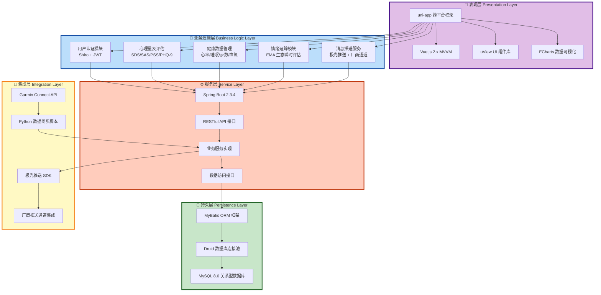
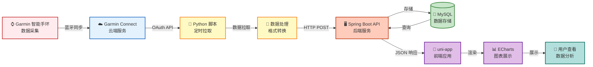
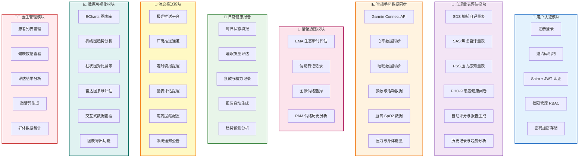
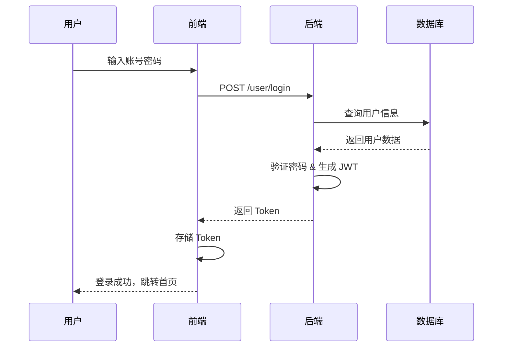
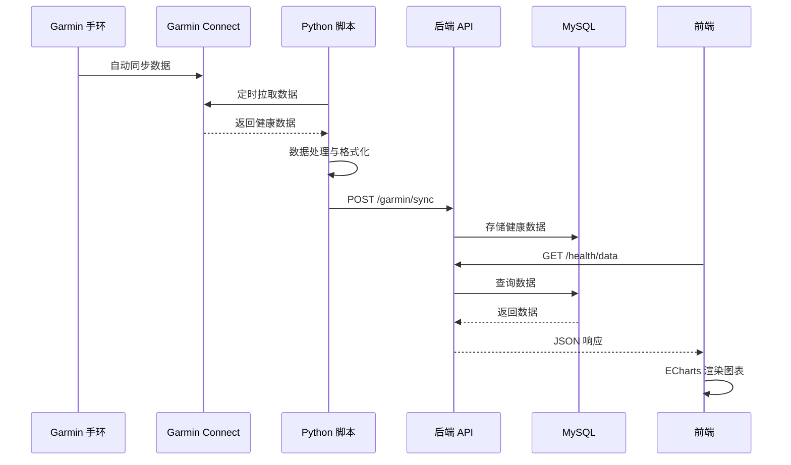
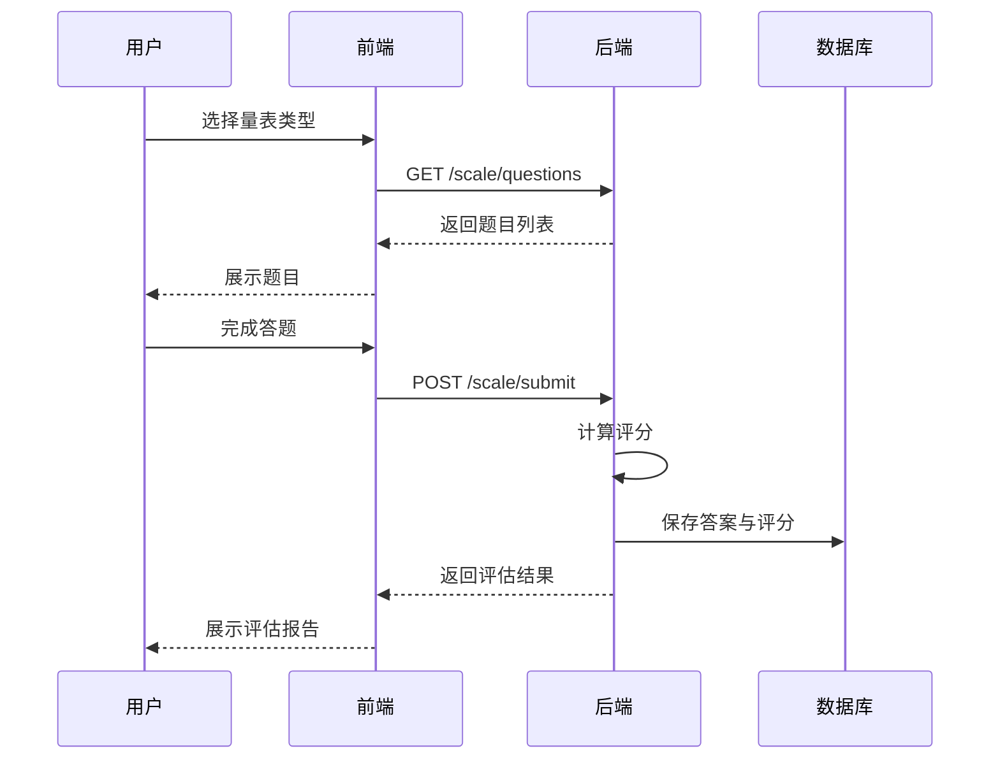

# 健康关怀系统 (Health Care System)

<div align="center">


一个集成心理健康评估、智能手环数据监测、情绪追踪的抑郁健康管理平台

</div>

---

## 📋 项目简介

健康关怀系统是一个面向抑郁患者心理健康管理的App，旨在通过多维度的数据采集和分析，帮助用户和医护人员更好地了解和管理心理健康状况。系统集成了标准化心理量表评估、智能手环健康数据同步、情绪日记记录等功能，为用户提供全方位的健康关怀服务。

### 🎯 核心特性

- 🧠 **心理健康评估** - 支持 SDS（抑郁自评）、SAS（焦虑自评）、PSS（压力感知）等标准量表
- 📊 **智能手环集成** - 通过 Garmin Connect API 同步心率、睡眠、步数、血氧等健康数据
- 💭 **情绪追踪** - EMA（生态瞬时评估）情绪记录与历史趋势分析
- 📈 **数据可视化** - 多维度健康数据图表展示与历史记录对比
- 🔔 **智能提醒** - 基于极光推送的健康数据填报提醒
- 👨‍⚕️ **医患互动** - 医生端数据查看与患者管理功能

---

## 🛠️ 技术栈

### 前端技术

| 技术 | 版本 | 说明 |
|------|------|------|
| **uni-app** | - | 跨平台应用开发框架 |
| **Vue.js** | 2.x | 前端 MVVM 框架 |
| **uView UI** | - | uni-app UI 组件库 |
| **ECharts** | - | 数据可视化图表库 |
| **HBuilderX** | - | 官方开发工具 |

### 后端技术

| 技术 | 版本 | 说明 |
|------|------|------|
| **Spring Boot** | 2.3.4 | 后端核心框架 |
| **MyBatis** | 2.1.3 | ORM 持久层框架 |
| **MySQL** | 8.0+ | 关系型数据库 |
| **Druid** | 1.1.8 | 数据库连接池 |
| **Apache Shiro** | 1.3.2 | 安全认证框架 |
| **JWT** | 3.2.0 | Token 认证 |
| **Swagger/Knife4j** | 2.9.2 | API 文档工具 |
| **极光推送** | 3.7.6 | 消息推送服务 |
| **Hutool** | 5.3.3 | Java 工具类库 |

### 第三方集成

| 服务 | 说明 |
|------|------|
| **Garmin Connect API** | 智能手环数据同步（Python 集成） |
| **极光推送 (JPush)** | 移动端消息推送 |
| **厂商推送** | OPPO、VIVO、华为、荣耀等厂商通道 |

---

## 🏗️ 项目架构

### 系统架构总览



### 数据流向图




## 📁 目录结构


### 前端目录结构

```
frontend/
├── pages/                      # 页面目录
│   ├── index/                 # 首页
│   ├── login/                 # 登录注册
│   ├── mine/                  # 个人中心
│   ├── health/                # 健康信息
│   │   ├── BasicInfo.vue     # 基本信息
│   │   └── DailyReport.vue   # 日常状态报告
│   ├── BraceletData/          # 手环数据
│   │   ├── HeartRateChart.vue    # 心率图表
│   │   ├── SleepChart.vue        # 睡眠图表
│   │   ├── DailyStepsChart.vue   # 步数图表
│   │   ├── BodyEnergyChart.vue   # 身体能量
│   │   ├── StressChart.vue       # 压力图表
│   │   └── Sp02Chart.vue         # 血氧图表
│   ├── Scale/                 # 心理量表
│   │   ├── SDS.vue           # 抑郁自评量表
│   │   ├── SAS.vue           # 焦虑自评量表
│   │   └── PSS.vue           # 压力感知量表
│   ├── Response/              # 测评报告
│   │   ├── RePHQ.vue         # 抑郁报告
│   │   ├── ReSAS.vue         # 焦虑报告
│   │   └── RePSS.vue         # 压力报告
│   ├── Chart/                 # 历史图表
│   │   ├── ChartMain.vue     # 图表主页
│   │   ├── DailyReportChart.vue  # 日常状态历史
│   │   ├── PAMChart.vue          # 情绪历史
│   │   └── DepressionChart.vue   # 抑郁历史
│   ├── Emotion/               # 情绪评估
│   │   └── EMA.vue           # 生态瞬时评估
│   ├── video/                 # 视频访谈
│   └── news/                  # 推荐资讯
├── components/                # 组件目录
│   ├── basic-table/          # 表格组件
│   ├── uni-forms/            # 表单组件
│   └── swiper/               # 轮播组件
├── static/                    # 静态资源
├── uni_modules/              # uni-app 插件
├── App.vue                   # 应用入口
├── main.js                   # 主入口文件
├── pages.json                # 页面配置
├── manifest.json             # 应用配置
└── package.json              # 依赖配置
```


### 后端目录结构

```
healthsystem-backend/
├── src/main/
│   ├── java/com/nwpu/healthsystem/backend/
│   │   ├── controller/           # 控制器层
│   │   │   ├── UserController.java
│   │   │   ├── GarminDataProcessController.java
│   │   │   ├── health/          # 健康数据控制器
│   │   │   ├── scale/           # 量表控制器
│   │   │   ├── answer/          # 答案控制器
│   │   │   └── news/            # 资讯控制器
│   │   ├── service/             # 服务层
│   │   │   ├── UserService.java
│   │   │   ├── JiGuangPushService.java
│   │   │   ├── health/          # 健康数据服务
│   │   │   └── scale/           # 量表服务
│   │   ├── mapper/              # 数据访问层
│   │   ├── entity/              # 实体类
│   │   │   ├── UserInfo.java
│   │   │   ├── health/          # 健康数据实体
│   │   │   └── scale/           # 量表实体
│   │   ├── shiro/               # 安全框架
│   │   │   ├── CustomRealm.java
│   │   │   ├── JWTFilter.java
│   │   │   └── JWTToken.java
│   │   ├── config/              # 配置类
│   │   │   ├── ShiroConfig.java
│   │   │   ├── DruidConfig.java
│   │   │   ├── JiGuangConfig.java
│   │   │   └── Swagger2Config.java
│   │   └── utils/               # 工具类
│   └── resources/
│       ├── application.yml      # 主配置文件
│       ├── application-deploy.yml  # 部署配置
│       ├── mybatis/             # MyBatis 配置
│       │   ├── mybatis-config.xml
│       │   └── mapper/          # SQL 映射文件
│       └── static/              # 静态资源
└── pom.xml                      # Maven 配置
```

### Python Garmin 集成模块

```
python-garminconnect-master/
├── garminconnect/              # Garmin API 封装
├── example_modify.py           # 数据同步脚本
├── pyproject.toml              # Python 项目配置
└── requirements-dev.txt        # 依赖列表
```

---

## ⚡ 核心功能模块
### 核心功能模块架构



### 1️⃣ 用户认证模块

- **注册登录**: 支持账号密码注册，邀请码机制
- **安全认证**: Shiro + JWT 双重认证
- **权限管理**: 基于角色的访问控制（用户/医生）
- **密码管理**: 密码加密存储，找回密码功能

### 2️⃣ 心理量表评估模块

#### 支持的量表类型

| 量表 | 全称 | 用途 |
|------|------|------|
| **SDS** | Self-Rating Depression Scale | 抑郁自评量表 |
| **SAS** | Self-Rating Anxiety Scale | 焦虑自评量表 |
| **PSS** | Perceived Stress Scale | 压力感知量表 |
| **PHQ-9** | Patient Health Questionnaire | 患者健康问卷 |

#### 功能特性

- ✅ 标准化量表题目与评分规则
- ✅ 自动计算评分与等级判定
- ✅ 生成专业评估报告
- ✅ 历史记录与趋势分析
- ✅ 图表可视化展示

### 3️⃣ 智能手环数据同步模块

#### 支持的健康指标

| 指标 | 说明 | 数据来源 |
|------|------|----------|
| **心率** | 实时心率、静息心率 | Garmin Connect |
| **睡眠** | 睡眠时长、深浅睡眠 | Garmin Connect |
| **步数** | 每日步数、活动距离 | Garmin Connect |
| **血氧** | SpO2 血氧饱和度 | Garmin Connect |
| **压力** | 压力指数监测 | Garmin Connect |
| **身体能量** | Body Battery 能量值 | Garmin Connect |

#### 数据同步流程

```
Garmin 手环 → Garmin Connect App → Garmin Cloud API 
    ↓
Python 脚本定时拉取 → 数据处理与存储 → MySQL 数据库
    ↓
后端 API 接口 → 前端数据展示 → 用户查看
```


### 4️⃣ 情绪追踪模块

- **EMA 评估**: 生态瞬时评估（Ecological Momentary Assessment）
- **情绪日记**: 记录当前情绪状态与触发事件
- **图像选择**: 通过图片选择表达情绪
- **历史趋势**: PAM 情绪历史图表分析

### 5️⃣ 日常健康报告模块

- **每日填报**: 睡眠质量、食欲、精力等日常状态
- **自动提醒**: 定时推送填报提醒
- **报告生成**: 自动生成每日健康状态报告
- **趋势分析**: 历史数据对比与趋势预测

### 6️⃣ 消息推送模块

#### 推送场景

- 📅 每日健康数据填报提醒（晚上 9 点）
- 📊 量表评估提醒
- 💊 用药提醒（可配置）
- 📢 系统通知与公告

#### 推送技术

- **极光推送**: 统一推送平台
- **厂商通道**: OPPO、VIVO、华为、荣耀、小米
- **别名机制**: 基于用户 ID 的精准推送
- **离线推送**: 支持离线消息存储

### 7️⃣ 数据可视化模块

- **ECharts 图表**: 折线图、柱状图、雷达图
- **多维度展示**: 时间序列、对比分析
- **交互式图表**: 支持缩放、数据点查看
- **导出功能**: 图表截图与数据导出

### 8️⃣ 医生管理模块

- **患者列表**: 查看所有关联患者
- **数据查看**: 查看患者健康数据与评估结果
- **邀请码管理**: 生成患者注册邀请码
- **数据统计**: 患者群体数据分析

---

## 🔄 核心工作流程


### 用户注册与登录流程



### 健康数据同步流程



### 量表评估流程



---

## ⚙️ 部署指南


### 环境要求

#### 后端环境

- **JDK**: 1.8+
- **Maven**: 3.6+
- **MySQL**: 8.0+
- **操作系统**: Linux / Windows / macOS

#### 前端环境

- **HBuilderX**: 最新版
- **Node.js**: 12.0+ (可选，用于 H5 开发)
- **Android Studio**: 用于 Android 打包
- **Xcode**: 用于 iOS 打包（仅 macOS）

#### Python 环境（Garmin 集成）

- **Python**: 3.10+
- **pip**: 最新版

### 后端部署步骤

#### 1. 数据库配置

```bash
# 创建数据库
mysql -u root -p
CREATE DATABASE healthsystem_test2 CHARACTER SET utf8mb4 COLLATE utf8mb4_unicode_ci;

# 导入数据库脚本（如果有）
mysql -u root -p healthsystem_test2 < database.sql
```

#### 2. 修改配置文件

编辑 `src/main/resources/application-deploy.yml`:

```yaml
spring:
  datasource:
    username: root
    password: your_password
    url: jdbc:mysql://localhost:3306/healthsystem_test2?serverTimezone=GMT%2B8

# 文件存储路径
file:
  filePath: /your/file/path

# 前端地址（用于二维码生成）
frontend:
  IP: https://your-domain.com:443/
```

#### 3. SSL 证书配置

将 SSL 证书放置在 `src/main/resources/` 目录下，并修改 `application.yml`:

```yaml
server:
  port: 1443
  ssl:
    key-store: classpath:your-cert.pfx
    key-store-password: your_password
    key-store-type: PKCS12
```

#### 4. 编译打包

```bash
cd healthsystem-backend6/healthsystem-backend
mvn clean package -DskipTests
```

#### 5. 运行服务

```bash
java -jar target/backend-0.0.1-SNAPSHOT.jar
```

或使用后台运行：

```bash
nohup java -jar target/backend-0.0.1-SNAPSHOT.jar > app.log 2>&1 &
```


### 前端部署步骤

#### 1. 配置后端地址

编辑 `frontend/nxTemp/config/index.config.js`:

```javascript
export default {
  baseUrl: 'https://your-backend-domain.com:1443',
  // 其他配置...
}
```

#### 2. HBuilderX 开发调试

1. 使用 HBuilderX 打开 `frontend` 目录
2. 运行 → 运行到浏览器 / 运行到手机或模拟器
3. 实时预览与调试

#### 3. 打包发布

##### Android 打包

1. 发行 → 原生 App-云打包
2. 配置打包参数：
   - 包名: `com.nwpu.healthmobile`
   - 证书别名: `nwpuhs`
   - 证书密码: `nwpuhs@ABC123!@#`
   - 证书文件: `nwpuhs.keystore`
3. 选择打包类型（测试/正式）
4. 提交打包

##### iOS 打包

1. 需要 Apple 开发者账号
2. 配置 iOS 证书与描述文件
3. 发行 → 原生 App-云打包
4. 选择 iOS 平台
5. 提交打包

##### H5 发布

```bash
# 发行 → H5-手机版
# 生成的文件在 unpackage/dist/build/h5 目录
# 将文件部署到 Web 服务器即可
```

### Python Garmin 集成部署

#### 1. 安装依赖

```bash
cd python-garminconnect-master
pip3 install -r requirements-dev.txt
# 或
pip3 install garminconnect
```

#### 2. 配置 Garmin 账号

```bash
export EMAIL=your_garmin_email
export PASSWORD=your_garmin_password
export GARMINTOKENS=~/.garminconnect
```

#### 3. 首次登录

```bash
python3 example_modify.py
# 按提示完成登录，生成 Token 文件
```

#### 4. 配置定时任务

使用 crontab 定时同步数据：

```bash
crontab -e

# 每小时同步一次
0 * * * * cd /path/to/python-garminconnect-master && python3 sync_data.py >> sync.log 2>&1
```

---

## 📦 API 接口文档


### 访问 API 文档

启动后端服务后，访问以下地址查看完整 API 文档：

- **Swagger UI**: `https://your-domain:1443/swagger-ui.html`
- **Knife4j UI**: `https://your-domain:1443/doc.html`

### 核心 API 接口

#### 用户认证接口

| 接口 | 方法 | 说明 | 认证 |
|------|------|------|------|
| `/user/login` | POST | 用户登录 | ❌ |
| `/user/register` | POST | 用户注册 | ❌ |
| `/user/logout` | POST | 用户登出 | ✅ |
| `/user/info` | GET | 获取用户信息 | ✅ |
| `/user/updatePassword` | POST | 修改密码 | ✅ |

#### 健康数据接口

| 接口 | 方法 | 说明 | 认证 |
|------|------|------|------|
| `/health/heartrate` | GET | 获取心率数据 | ✅ |
| `/health/sleep` | GET | 获取睡眠数据 | ✅ |
| `/health/steps` | GET | 获取步数数据 | ✅ |
| `/health/spo2` | GET | 获取血氧数据 | ✅ |
| `/health/stress` | GET | 获取压力数据 | ✅ |
| `/health/bodyBattery` | GET | 获取身体能量 | ✅ |

#### 量表评估接口

| 接口 | 方法 | 说明 | 认证 |
|------|------|------|------|
| `/scale/sds/questions` | GET | 获取 SDS 题目 | ✅ |
| `/scale/sds/submit` | POST | 提交 SDS 答案 | ✅ |
| `/scale/sas/questions` | GET | 获取 SAS 题目 | ✅ |
| `/scale/sas/submit` | POST | 提交 SAS 答案 | ✅ |
| `/scale/pss/questions` | GET | 获取 PSS 题目 | ✅ |
| `/scale/pss/submit` | POST | 提交 PSS 答案 | ✅ |
| `/scale/history` | GET | 获取历史记录 | ✅ |

#### 日常报告接口

| 接口 | 方法 | 说明 | 认证 |
|------|------|------|------|
| `/answer/dailyReport` | POST | 提交日常报告 | ✅ |
| `/answer/dailyReport/list` | GET | 获取报告列表 | ✅ |
| `/answer/basicInfo` | POST | 提交基本信息 | ✅ |

#### Garmin 数据同步接口

| 接口 | 方法 | 说明 | 认证 |
|------|------|------|------|
| `/garmin/sync` | POST | 同步 Garmin 数据 | ✅ |
| `/garmin/process` | POST | 处理 Garmin 数据 | ✅ |

### 请求示例

#### 登录请求

```bash
curl -X POST https://your-domain:1443/user/login \
  -H "Content-Type: application/json" \
  -d '{
    "username": "testuser",
    "password": "password123"
  }'
```

响应：

```json
{
  "code": 200,
  "message": "登录成功",
  "data": {
    "token": "eyJhbGciOiJIUzI1NiIsInR5cCI6IkpXVCJ9...",
    "userInfo": {
      "userId": 1,
      "username": "testuser",
      "role": "user"
    }
  }
}
```


#### 获取心率数据

```bash
curl -X GET "https://your-domain:1443/health/heartrate?startDate=2024-01-01&endDate=2024-01-31" \
  -H "Authorization: Bearer YOUR_JWT_TOKEN"
```

响应：

```json
{
  "code": 200,
  "message": "success",
  "data": [
    {
      "date": "2024-01-01",
      "avgHeartRate": 72,
      "maxHeartRate": 145,
      "minHeartRate": 58,
      "restingHeartRate": 62
    }
  ]
}
```

---

## 💡 常见问题

### Q1: 如何配置极光推送？

**A**: 需要在极光推送官网注册应用，获取 AppKey 和 Master Secret，然后配置到：

1. 前端 `manifest.json` 中的 `nativePlugins` 配置
2. 后端 `JiGuangConfig.java` 配置类

### Q2: Garmin 数据同步失败怎么办？

**A**: 检查以下几点：

1. Garmin 账号密码是否正确
2. Token 文件是否过期（有效期 1 年）
3. 网络连接是否正常
4. Python 依赖是否完整安装

重新登录生成 Token：

```bash
rm -rf ~/.garminconnect
python3 example_modify.py
```

### Q3: 前端无法连接后端接口？

**A**: 检查：

1. 后端服务是否正常运行
2. 前端配置的 `baseUrl` 是否正确
3. SSL 证书是否有效
4. 防火墙是否开放 1443 端口
5. 跨域配置是否正确（后端 `CorsConfig.java`）

### Q4: 如何添加新的心理量表？

**A**: 按以下步骤：

1. 在数据库创建量表题目表和答案表
2. 创建对应的 Entity、Mapper、Service、Controller
3. 前端创建量表页面和报告页面
4. 配置路由和导航

### Q5: 如何自定义推送时间？

**A**: 修改前端 `App.vue` 中的定时推送配置：

```javascript
let nine = new Date();
nine.setHours(21, 0, 0, 0); // 修改为你想要的时间
```

或在后端实现定时任务推送。

### Q6: 数据库连接失败？

**A**: 检查：

1. MySQL 服务是否启动
2. 数据库名、用户名、密码是否正确
3. 数据库字符集是否为 `utf8mb4`
4. MySQL 版本是否兼容（建议 8.0+）

### Q7: 如何备份数据？

**A**: 

```bash
# 备份数据库
mysqldump -u root -p healthsystem_test2 > backup_$(date +%Y%m%d).sql

# 备份上传文件
tar -czf files_backup_$(date +%Y%m%d).tar.gz /your/file/path
```

### Q8: 如何查看日志？

**A**: 

- 后端日志: 查看控制台输出或 `app.log` 文件
- 前端日志: 使用浏览器开发者工具或真机调试
- Garmin 同步日志: 查看 `sync.log` 文件

### Q9: 支持哪些手环品牌？

**A**: 目前仅支持 Garmin 品牌手环，因为使用了 Garmin Connect API。如需支持其他品牌，需要集成对应的 API（如小米、华为等）。

### Q10: 如何重置用户密码？

**A**: 

1. 通过前端"忘记密码"功能（需配置邮箱/短信）
2. 或直接在数据库修改（密码需加密）：

```sql
-- 注意：实际密码需要使用 Shiro 加密
UPDATE user_info SET password = 'encrypted_password' WHERE user_id = 1;
```


## 🙏 致谢

- [uni-app](https://uniapp.dcloud.io/) - 跨平台应用开发框架
- [Spring Boot](https://spring.io/projects/spring-boot) - Java 后端框架
- [Garmin Connect API](https://github.com/cyberjunky/python-garminconnect) - Garmin 数据集成
- [极光推送](https://www.jiguang.cn/) - 消息推送服务
- [ECharts](https://echarts.apache.org/) - 数据可视化库

---

<div align="center">

**⭐ 如果这个项目对你有帮助，请给一个 Star！⭐**

Made with ❤️ by Health Care Team

</div>
